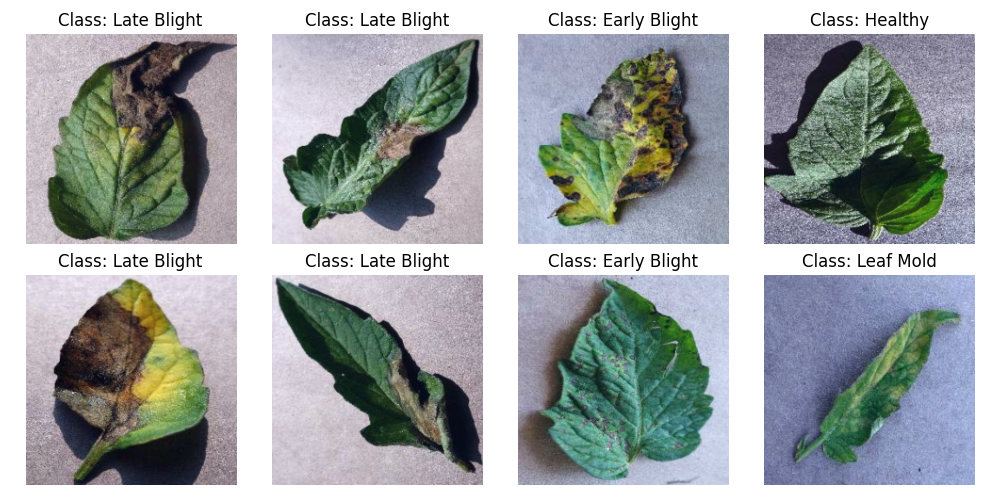
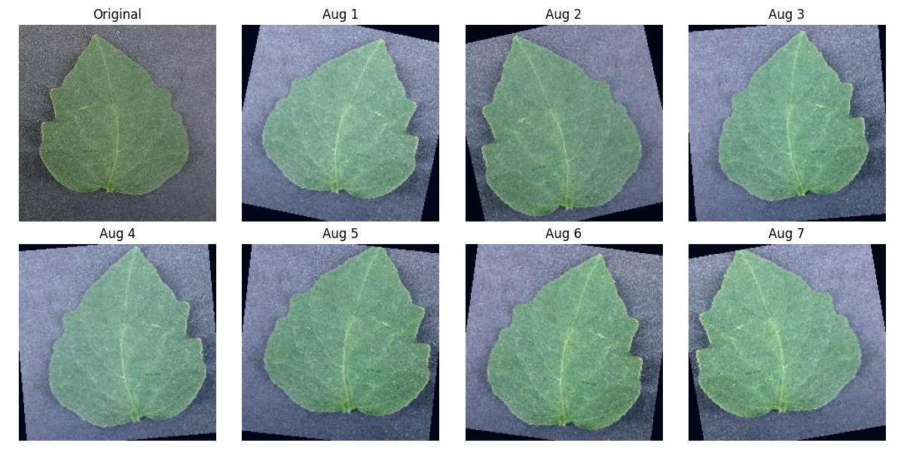
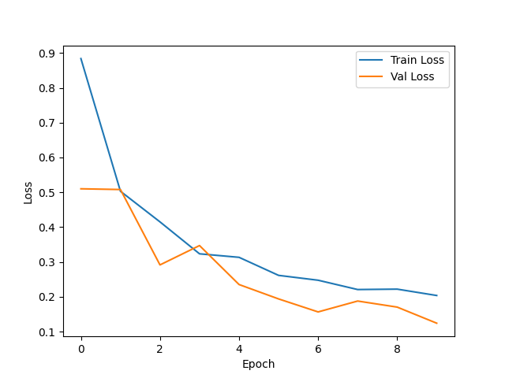
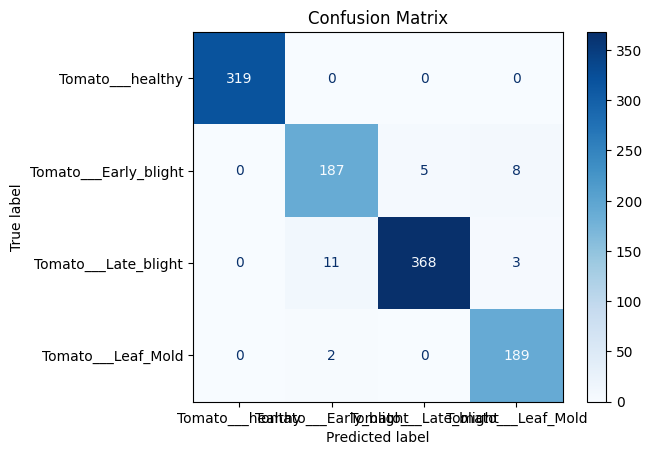

# 🌿 Plant Leaf Disease Detector

An end-to-end Deep Learning application for automatic tomato leaf disease detection using **PyTorch**, **ResNet18**, **FastAPI**, and **Docker**.

---

# 📌 Project Overview

This project detects diseases in tomato leaves from images using a deep learning model. It classifies each input image into one of four categories and provides predictions through both a command-line interface and a REST API.

The project covers the complete machine learning workflow:

* Dataset preparation
* Data preprocessing and augmentation
* Model training
* Model evaluation
* Inference
* FastAPI deployment
* Docker containerization

---

# ✨ Features

* Image preprocessing and augmentation
* Transfer Learning using ResNet18
* Command-line prediction
* FastAPI REST API
* Interactive Swagger documentation
* Docker support
* TorchScript model export
* Confusion Matrix and Classification Report
* Error analysis with misclassified samples

---

# 📂 Dataset

Dataset: **Tomato Leaf Disease Dataset**

### Classes

* Tomato___healthy
* Tomato___Early_blight
* Tomato___Late_blight
* Tomato___Leaf_Mold

Images are resized to **224 × 224** and normalized using ImageNet statistics before training.

---

# 🏗️ Project Structure

```text
leaf-disease-cv/
│
├── api/
│   └── main.py
│
├── data/
│   ├── raw/
│   ├── train/
│   └── val/
│
├── docs/
│   └── CAPSTONE_REPORT.md
│
├── models/
│   ├── class_names.json
│   ├── leaf_cnn_best.pth
│   ├── leaf_cnn_epoch5.pth
│   ├── resnet18_best.pth
│   └── resnet18_scripted.pt
│
├── reports/
│   ├── classification_report.txt
│   ├── confusion_matrix.png
│   ├── error_analysis.md
│   └── errors/
│
├── src/
│   ├── augmentation_visualization.py
│   ├── dataset_loader.py
│   ├── evaluate.py
│   ├── export_model.py
│   ├── model.py
│   ├── predict.py
│   ├── resnet18_best.py
│   ├── split_dataset.py
│   ├── train.py
│   ├── transforms.py
│   └── visualize_batch.py
│
├── augmentation_grid.png
├── sample_batch.png
├── training_plot.png
├── Dockerfile
├── DEPLOY.md
├── README.md
├── requirements.txt
├── requirements-api.txt
├── verify_gpu.py
├── .dockerignore
└── .gitignore
```

---

# ⚙️ Environment

* Python 3.11
* PyTorch 2.12.0 (CPU)
* torchvision 0.27.0
* FastAPI
* Docker

---

# 🧠 Model

The project uses **Transfer Learning with ResNet18**.

### Training Configuration

| Parameter      | Value            |
| -------------- | ---------------- |
| Optimizer      | Adam             |
| Loss Function  | CrossEntropyLoss |
| Learning Rate  | 0.001            |
| Batch Size     | 32               |
| Epochs         | 10               |
| Early Stopping | Patience = 3     |

---

# 📊 Model Performance

The trained model was evaluated on **1,092 validation images**.

## Overall Results

| Metric    |   Score |
| --------- | ------: |
| Accuracy  | **97%** |
| Precision | **97%** |
| Recall    | **97%** |
| F1-score  | **97%** |

## Per-Class Performance

| Class        | Precision | Recall | F1-score |
| ------------ | --------: | -----: | -------: |
| Healthy      |      1.00 |   1.00 |     1.00 |
| Early Blight |      0.94 |   0.94 |     0.94 |
| Late Blight  |      0.99 |   0.96 |     0.97 |
| Leaf Mold    |      0.94 |   0.99 |     0.97 |

The model achieved **97% overall accuracy** on the validation dataset. Most prediction errors occurred between **Early Blight** and **Late Blight** due to their similar visual appearance.

---

# 📈 Training Results

Sample Traning batch




Sample Data Augmentation



Training Loss Curve



Confusion Matrix




---

# 📊 Evaluation

The evaluation pipeline generates:

* Classification Report
* Confusion Matrix
* Misclassified Image Samples

Example:

```bash
python src/evaluate.py
```

---

# 🔍 Prediction

Predict a single image:

```bash
python src/predict.py --image "path/to/image.jpg"
```

Example Output

```text
Prediction : Tomato___healthy
Confidence : 99.84%
```

---

# 🌐 FastAPI

Run the API:

```bash
uvicorn api.main:app --reload
```

Swagger Documentation

```
http://localhost:8000/docs
```

Health Endpoint

```
GET /health
```

Response

```json
{
  "status": "healthy"
}
```

Prediction Endpoint

```
POST /predict
```

---

# 🐳 Docker

Build the Docker image

```bash
docker build -t leaf-disease-api .
```

Run the container

```bash
docker run -p 8000:8000 leaf-disease-api
```

---

# 🚀 Technologies Used

* Python
* PyTorch
* Torchvision
* FastAPI
* Docker
* NumPy
* Pillow
* Matplotlib
* Scikit-learn

---

# 📌 Future Improvements

* Support additional crop diseases
* Cloud deployment
* Mobile application
* Real-time camera inference
* Edge-device deployment

---

# 👨‍💻 Author

**Anukrishna T K**

B.Tech Computer Science and Engineering

Cochin University of Science and Technology (CUSAT)
